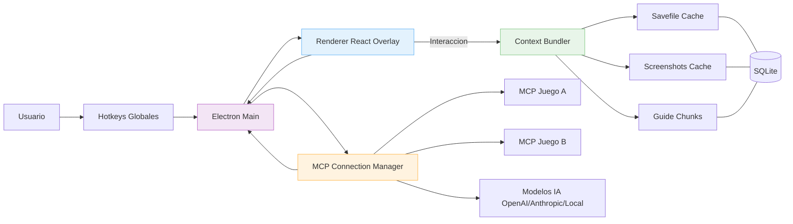

# Tornado MCP Client

Universal AI overlay client for video games using Model Context Protocol (MCP)

Tornado es un overlay transparente estilo “Discord overlay” que agrega IA a cualquier videojuego a través de MCPs específicos por juego. Carga contexto relevante (savefile, screenshot, guía) y lo envía a las herramientas del MCP para dar respuestas útiles en tiempo real.

## ¿Qué es MCP y cómo lo usamos?

[MCP](https://modelcontextprotocol.io/) define cómo clientes y servidores de herramientas comparten contexto y se invocan de manera segura. Tornado actúa como cliente MCP y cada juego tiene su “MCP de juego” (servidor) que expone herramientas.

Estándar mínimo que debe cumplir un MCP de juego:
- `analyze_savefile`: parsea el savefile y devuelve JSON utilizable
- `take_screenshot`: captura/obtiene una referencia de screenshot del juego
- `download_guide`: descarga o referencia una guía/compendio del juego

Tornado combina este contexto automáticamente antes de cada interacción.

Ejemplo de MCP de juego: [hollow-knight-mcp (PR)](https://github.com/gzzydevs/hollow-knight-mcp/pull/1).

## MCPs permitidos: política de uso

Permitido:
- Lectura de archivos locales del usuario (savefiles), screenshots y guías/documentación
- Automatizaciones externas que NO inyecten código en el proceso del juego
- Uso educativo, personal y no comercial (ver licencia)

No permitido por Tornado (ni distribuiremos MCPs que lo hagan):
- Inyección de memoria o código en el proceso del juego
- Cheats, hacks, bypass de anti-cheat, o actividades que violen TOS de juegos
- Ingeniería maliciosa o scraping que infrinja propiedad intelectual

## Arquitectura (alto nivel)

Tornado es una app Electron con React + TypeScript. La ventana del overlay es transparente, sin marco, siempre on-top y con modo click-through; soporta multi-monitor y hotkeys globales.



Componentes:
- Main (Electron): ciclo de vida, hotkeys, IPC, overlay
- Renderer (React): UI (chat, selector de modelo, acciones, estado)
- MCP Connection Manager: múltiples MCPs, reconexión, namespaces
- Context Bundler: empaqueta savefile + screenshot + guía con chunking y sampling
- SQLite DB: metadatos de MCPs, cachés y configuraciones por juego

## Tecnologías

- Electron: overlay transparente (`setIgnoreMouseEvents`), always-on-top, `screen` para monitores
- React + TypeScript + Vite: UI y hot reload en desarrollo
- SQLite (p. ej. better-sqlite3): persistencia de metadatos y cachés
- @modelcontextprotocol/sdk: cliente MCP (transporte stdio u otros)
- Empaquetado: electron-builder (Windows/macOS/Linux)
- Captura: `desktopCapturer` (con consentimiento)
- Hotkeys: `globalShortcut` (main) + atajos en UI (preload + contextBridge)
- Modelos: API keys (OpenAI/Anthropic/otros) u opción local (Ollama/LM Studio)

## Modos de sampling y modelos

- Modo API Key: conexión directa a modelos con tu API key
- Modo GitHub Free: integración con VS Code/GitHub para planes gratuitos (si aplica)

## Detección de juegos

- Detección de procesos/ventanas para asociar MCPs instalados
- Auto-carga del MCP correcto al detectar el juego
- Overrides de reglas por MCP (process name/window title)

## Estructura de carpetas (propuesta)

```
src/
  main/        # Electron main (ventana, IPC, hotkeys)
  renderer/    # React UI (chat, selector, acciones)
  shared/      # Tipos y utilidades comunes
  db/          # Acceso SQLite y DAOs
mcps/          # MCPs instalados (npm/local)
cache/         # screenshots, guías chunked, parseos
```

## Instalación y desarrollo

Requisitos: Node 18+ (recomendado Node 20 LTS), pnpm o npm/yarn.

```bash
pnpm install
pnpm dev   # arranca Electron con hot reload
pnpm build # genera binarios con electron-builder
```

Variables de entorno (ejemplo `.env`):
```
OPENAI_API_KEY=...
ANTHROPIC_API_KEY=...
TORNADO_SENTRY_DSN=...
```

## Configuración de MCPs

- Instalación desde npm o ruta local
- Validación: el MCP debe exponer `analyze_savefile`, `take_screenshot`, `download_guide`
- Config por MCP: rutas de savefile/guía, overrides de hotkeys, opciones avanzadas
- Multi-MCP: cargar varios MCPs en paralelo con namespaces aislados

## UI del overlay

- Chat con render de markdown y estado “pensando”
- Selector de modelo y parámetros (temperatura, tokens máx.)
- Botones de acción rápida por MCP activo
- Indicadores de estado: MCP conectado, contexto cargado (savefile/screenshot/guía)

## Rendimiento y seguridad

- Minimizar impacto en FPS: render ligero, throttling y lazy-load de UI
- Permisos explícitos para captura de pantalla
- IPC seguro con `contextIsolation` y `preload` (no exponer APIs sensibles)

## Roadmap (milestones)

- Foundation: setup + README + overlay base
- Core MCP: cliente MCP, sampling, modos de conexión
- Game Integration: detección de juegos, gestión de MCPs y DB
- UI/UX: chat, modelos, acciones, estados
- Context System: integración de tools obligatorias
- Polish & Distribution: performance, empaquetado, documentación

## Licencia

Licencia dual:
- AGPL-3.0 (ver `LICENSE.md`)
- Licencia comercial (ver `LICENSE-COMMERCIAL.md`)
Incluye Excepción de Uso Personal No Comercial (detallada en `LICENSE.md`).

Para licencias comerciales: barbycus@gmail.com
